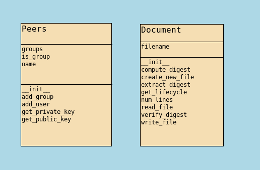

# Decentralised-enforcement-of-artifact-lifecycle


This project contains 3 files:
*   main.py
*   key_generation_peers.py
*   document_lifecycle.py

Requirements:
*   Python 3.7
*   rsa library *pip install rsa*
*   hashlib     
*   os


To run code:

```bash
    python3 main.py
```




Here, we have to divide a set of users into groups where each user can be assigned multiple groups.
Each group has its own set of private and public key which can be used for making encryption and decryption.
Each user also has its own set of private and public keys which can be used to verify identity of user performing action.

In this project, I have taken two groups and seven users.

>Groups
> * Computer Science (Group 1)
> * Electrical (Group 2)

<table>
<tr>
<th> Users </th>
<th> Groups Assigned </th>
</tr>
<tr>
<td> Gaurav </td>
<td> Group 1 </td>
</tr>
<tr>
<td> Alice </td>
<td> Group 2 </td>
</tr><tr>
<td> Rahul </td>
<td> Group 1 </td>
</tr><tr>
<td> Bob </td>
<td> Group 2 </td>
</tr><tr>
<td> Rajat </td>
<td> Group 1 </td>
</tr><tr>
<td> Charlie </td>
<td> Group 2 </td>
</tr><tr>
<td> Admin </td>
<td> Group 1, Group 2 </td>
</tr>
</table>

Users will be performing actions (write) on a common shared document between all the users.
Users also need to mention through which group they are performing action.
If action is verified, required changes will be made in file and digest based on 
RSA, sha256, older digest and user private key will be added along with some details in the action sequence.

> If user won't have access to that group, he can't perform action.

In the last, I have also shown how any user can verify the file using action sequences and calculated digest.
This can be done by any user but actual action performed can only be read by members of that group.
